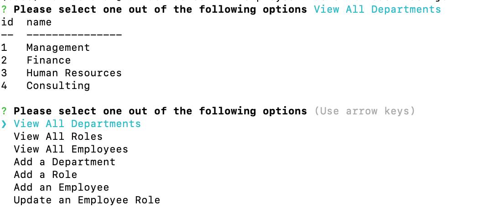
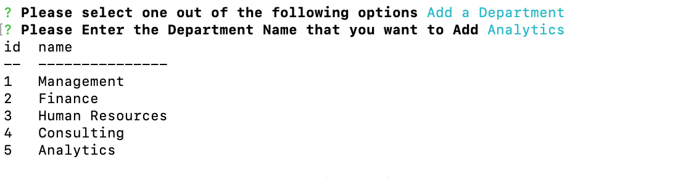

# employee-tracker

# Description

 This project creates an application called Employee Trcaker that enables employers to to view and manage the departments, roles, and employees in the company.

# Installation

Clone the employee-tracker repository to your local machine. The db folder contains the schema.sql and seeds.sql file which contains the tables and data populated into them.

# Screenshot 
The following screenshot demonstrates the application functionality:

# Link to Walk-through Video

https://drive.google.com/file/d/1NnkMCXKiAlqGr6TRb78Ij3_9iZkjPHKo/view
